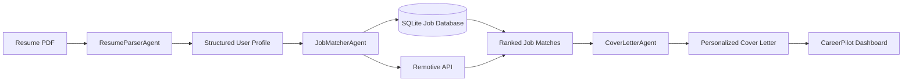

# CareerPilot AI: An Intelligent Multi-Agent Career Coach for Equalizing Job Opportunities 🚀

**Track:** Agents for Good

**Subtitle:** Empowering job seekers with an autonomous multi-agent AI assistant for resume intelligence, unified job discovery, skill-gap analysis, and personalized application support.

---

# 1. Core Concept & Value

**Rubric Category:** Concept & Value (10 pts)

## Problem Statement

Finding the right job today is fragmented, repetitive, and often discouraging.

Candidates spend hours searching across multiple job platforms, optimizing resumes for Applicant Tracking Systems (ATS), tailoring cover letters, and trying to determine whether they are actually qualified for a role. Meanwhile, applicants with access to professional career coaches, premium resume services, or strong industry networks gain a significant advantage.

CareerPilot AI was built to bridge this gap.

It acts as a free, intelligent AI Career Coach that combines job discovery, resume analysis, and application assistance into one seamless experience, making professional career guidance accessible to everyone.

---

## What CareerPilot AI Does

CareerPilot AI assists job seekers throughout the application process by:

### 📄 Resume Intelligence

- Extracts skills, education, experience, certifications, and projects from PDF resumes.
- Converts unstructured resumes into structured candidate profiles.

### 🌐 Unified Job Search

Instead of searching multiple websites individually, CareerPilot AI aggregates job opportunities into one platform.

Current providers include:

- Remotive
- Local SQLite Job Database

The architecture is provider-based and designed to support additional providers such as:

- Google Jobs
- Greenhouse
- LinkedIn
- Adzuna
- SerpAPI

This eliminates repetitive searching across multiple job portals.

---

### 🧠 Intelligent Query Understanding

CareerPilot AI understands what users actually mean instead of relying on exact keyword matches.

Examples include:

- Bangalore ↔ Bengaluru
- SDE ↔ Software Engineer
- Developer ↔ Software Developer
- ML Engineer ↔ Machine Learning Engineer

Through normalization, synonym mapping, and fuzzy matching, CareerPilot AI returns significantly more relevant job results.

---

### 🎯 AI Job Matching

CareerPilot AI compares the candidate profile with job descriptions to:

- Calculate compatibility scores (0–100%)
- Highlight matching skills
- Identify missing skills
- Explain why a job is recommended

---

### 📊 Skill Gap Analysis

Rather than simply saying "You are not qualified,"

CareerPilot AI identifies:

- Missing technologies
- Required certifications
- Experience gaps
- Resume improvement suggestions

giving users an actionable roadmap toward their desired role.

---

### ✍️ Personalized Application Generation

CareerPilot AI generates:

- ATS-friendly cover letters
- Resume improvement suggestions

while ensuring no fabricated experience or skills are introduced.

---

## Why This Matters

CareerPilot AI democratizes access to professional career coaching.

Instead of spending hours:

- searching multiple job boards,
- manually comparing job descriptions,
- rewriting resumes,
- and creating generic cover letters,

users receive intelligent, personalized career assistance within minutes.

---

# 2. Meaningful Use of Agents

Traditional chatbots simply answer questions.

CareerPilot AI uses autonomous AI agents.

Each agent:

- has a dedicated responsibility,
- maintains conversation context,
- utilizes external tools,
- queries structured databases,
- produces validated outputs,
- and collaborates with downstream agents.

This modular design improves:

- accuracy
- scalability
- maintainability
- token efficiency
- response quality

---

# 3. Multi-Agent Architecture

**Rubric Category:** YouTube & Writeup (10 pts)

## Why Multiple Agents?

A single LLM prompt cannot effectively solve this workflow because:

- it cannot efficiently access databases,
- loading every job description exceeds context limits,
- massive prompts increase hallucinations,
- costs grow significantly,
- and maintainability becomes difficult.

CareerPilot AI instead combines:

- AI Agents
- External Tools
- Database Search
- Persistent Memory

into a coordinated pipeline.

---

## Architecture



---

## ResumeParserAgent

**Model:** Gemini 3.5 Flash

### Responsibility

Transforms an unstructured resume into a structured candidate profile.

### Why?

Separating resume parsing ensures downstream agents receive reliable, standardized information rather than inconsistent raw text.

Output:

- Skills
- Experience
- Education
- Projects
- Certifications

---

## JobMatcherAgent

**Model:** Gemini 3.5 Flash

### Responsibility

Matches candidate profiles against available job opportunities.

Responsibilities include:

- Database querying
- Job retrieval
- Compatibility scoring
- Skill gap identification
- Resume recommendations
- Job ranking

This agent is optimized purely for reasoning and evaluation.

---

## CoverLetterAgent

**Model:** Gemini 3.5 Flash

### Responsibility

Generates professional, ATS-friendly cover letters using only verified resume information.

This ensures:

- personalization
- factual accuracy
- professional tone
- zero hallucinated experience

---

# 4. Technical Implementation

**Rubric Category:** Implementation (50 pts)

## Technology Stack

| Component | Technology |
|------------|------------|
| Agent Framework | Google Agent Development Kit (ADK) |
| LLM | Gemini 3.5 Flash |
| Backend | FastAPI |
| Database | SQLite |
| ORM | SQLAlchemy + aiosqlite |
| Validation | Pydantic |
| Retry Strategy | Tenacity |
| Frontend | HTML5 + CSS3 + Vanilla JavaScript |

---

## Intelligent Data Pipeline

CareerPilot AI follows a provider-based architecture.

```
Resume

↓

ResumeParserAgent

↓

Structured Profile

↓

JobMatcherAgent

↓

SQLite + Remotive

↓

Ranked Jobs

↓

CoverLetterAgent

↓

Personalized Career Assistance
```

This separation keeps each agent focused on a single responsibility while improving scalability and reducing LLM token usage.

---

## Database Design

### Composite Unique Constraints

Bookmarks use:

```
(user_id, job_id)
```

preventing duplicate bookmarks at the database level.

---

### Intelligent Job Retrieval

CareerPilot AI:

- fetches jobs from Remotive,
- cleans HTML,
- normalizes metadata,
- parses skills,
- removes duplicates,
- stores jobs asynchronously.

---

### Smart Job Filtering

The search engine supports:

- keywords
- locations
- remote jobs
- experience level
- case-insensitive matching

---

## Security

### Zero Hardcoded Secrets

Sensitive credentials are managed using:

```
python-dotenv
```

Example:

```env
GEMINI_API_KEY=your_api_key
```

---

### Repository Safety

Sensitive files excluded through `.gitignore`:

```
.env

data/*.db
```

---

# 5. Setup & Installation

**Rubric Category:** Documentation (20 pts)

## Prerequisites

- Python 3.13+
- Gemini API Key

---

## Clone Repository

```bash
git clone https://github.com/mxrci580/careerpilot-ai.git

cd careerpilot-ai
```

---

## Create Virtual Environment

```bash
python3 -m venv .venv

source .venv/bin/activate
```

---

## Install Dependencies

```bash
pip install -r requirements.txt
```

---

## Configure Environment

Create a `.env` file.

```env
GEMINI_API_KEY=your_actual_api_key
```

---

## Run

```bash
python -m uvicorn app.main:app --reload
```

---

## Open

```
http://127.0.0.1:8000/
```

Upload your resume and let CareerPilot AI:

- 📄 Parse your resume
- 🌐 Aggregate jobs from multiple sources
- 🧠 Understand intelligent search queries
- 🎯 Rank opportunities
- 📊 Identify skill gaps
- ✍️ Generate personalized cover letters

—all through a coordinated multi-agent AI system designed to make professional career guidance accessible to everyone.

---

# Why CareerPilot AI?

Unlike traditional job portals that simply list vacancies, CareerPilot AI acts as an intelligent career companion.

It doesn't just help users **find jobs**—it helps them **understand**, **prepare**, and **apply** more effectively.

By combining unified job aggregation, intelligent query understanding, multi-agent reasoning, resume intelligence, skill-gap analysis, and personalized application generation, CareerPilot AI transforms a fragmented and time-consuming job search into a guided, AI-powered career journey.
