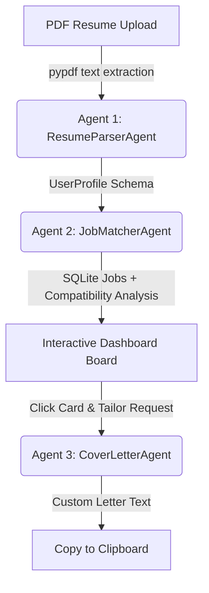

# CareerPilot: An Intelligent AI Career Coach for Equalizing Job Opportunities 🚀

**Track**: Agents for Good  
**Subtitle**: Empowering job-seekers with an autonomous, multi-agent assistant for resume intelligence, job retrieval, and application tailoring.

---

## 1. Core Concept & Value (Rubric Category: Concept & Value - 10 pts)

### Relevance to the "Agents for Good" Track
The modern job application process is unequal. Large corporations use automated Applicant Tracking Systems (ATS) to filter out candidates, while candidates spend hundreds of hours manually searching portals and writing generic cover letters. This process favors applicants with access to professional career coaches, expensive resume editors, and pre-existing industry networks.

**CareerPilot** acts as a free, high-quality, personalized AI Career Coach. It levels the playing field by helping applicants:
1. **Parse & Extract**: Extract skills and experience from a PDF resume into a standardized profile.
2. **Retrieve Live Jobs**: Fetch real-time openings from the Remotive API keylessly and query local SQLite databases.
3. **Analyze Alignment**: Compare their skills against job requirements to calculate compatibility scores ($0-100\%$) and map skill gaps.
4. **Tailor Applications**: Re-frame accomplishments and generate custom cover letters targeting specific roles without fabricating details.

By automating these processes, CareerPilot makes professional career coaching accessible to everyone, regardless of background or financial means.

### The Meaningful Use of Agents
In CareerPilot, agents are **active, stateful decision-makers** equipped with custom database search tools, strict output schemas, and API connectors. They hold context (memory) across conversational turns, decide when to query databases, and execute structured parsing tasks, acting as autonomous units that coordinate to help the user.

---

## 2. Multi-Agent Architecture (Rubric Category: YouTube & Writeup - 10 pts)

### Why Agents for this Problem?
A single, standard LLM prompt cannot solve the job matching problem. The reasoning required is too complex:
* A standard LLM lacks access to databases or local files.
* Loading all jobs and resumes into a single context (stuffer prompts) exceeds reasoning limits, increases costs, and leads to hallucinations.

Agents solve this by wrapping the LLM with **Tools** (to query databases) and **Memory** (to persist conversation states).

### The Sequential Multi-Agent Pipeline (The "Chain" Pattern)
To ensure maximum speed, lower token costs, and high accuracy, CareerPilot utilizes three specialized agents in sequence, adhering to the **Single Responsibility Principle**:



1. **Agent 1: ResumeParserAgent** (`models/gemini-3.5-flash`):
   * *Role*: Reads raw resume text, parses it, and maps it into a structured **`UserProfile`** Pydantic model.
   * *Why*: Decoupled to focus strictly on structural data extraction.
2. **Agent 2: JobMatcherAgent** (`models/gemini-3.5-flash`):
   * *Role*: Compares the candidate profile against job descriptions, calculates compatibility scores, highlights matching/missing skills, and outlines resume advice. Output is mapped to the **`JobMatchResultsList`** schema.
   * *Why*: Laser-focused on evaluation; handles database cross-referencing.
3. **Agent 3: CoverLetterAgent** (`models/gemini-3.5-flash`):
   * *Role*: Writes a persuasive, customized cover letter matching the candidate's actual credentials to the job role.
   * *Why*: Dedicated strictly to creative, context-aligned editing and professional tone.

---

## 3. Technical Implementation & Tool Use (Rubric Category: Implementation - 50 pts)

### Technical Stack
* **Agent Framework**: Google Agent Development Kit (ADK) — chosen for its native async workflow, session runners, and modular tool integrations.
* **Backend**: FastAPI — high-performance asynchronous REST API.
* **Database**: SQLite & SQLAlchemy (with `aiosqlite`) — provides zero-setup, async, file-based SQL persistence.
* **Resiliency**: Tenacity — implements exponential backoff retries to automatically bypass transient Google API 503 (high demand) and 429 (rate limits).
* **Data Validation**: Pydantic — guarantees type-safe inputs/outputs.
* **Frontend**: HTML5 / CSS3 (Vanilla CSS with Glassmorphism variables) / Vanilla JavaScript (dynamic DOM bindings).

### Clever Database & API Tooling
* **Composite Unique Constraint**: The `bookmarks` table utilizes a composite unique constraint on `(user_id, job_id)`. This enforces data cleanliness at the database layer, rejecting duplicate bookmark rows if a user double-clicks.
* **Remotive Ingestion Integration**: The `fetch_and_store_jobs()` pipeline queries the Remotive API keylessly, scrubs HTML code from descriptions, parses tags, and commits new software development openings to SQLite without duplicates.
* **SQL Query Filters**: The `/api/jobs` endpoint queries the SQLite database using SQL case-insensitive `icontains` filters for keywords, experience levels (Junior vs. Senior), location, and WFH/remote preferences.

### Security & Secrets Management
* **Zero Hardcoded Secrets**: All API keys (like `GEMINI_API_KEY`) are loaded dynamically using `python-dotenv`.
* **Repository Safety**: The `.env` file containing private credentials and SQLite database files (`data/*.db`) are explicitly listed in `.gitignore` to prevent leakage.

---

## 4. Setup, Installation & Documentation (Rubric Category: Documentation - 20 pts)

### Prerequisites
* Python 3.13+
* Gemini API Key (obtained for free from Google AI Studio)

### Local Installation & Running

1. **Clone the repository**:
   ```bash
   git clone https://github.com/mxrci580/careerpilot-ai.git
   cd careerpilot-ai
   ```

2. **Set up a Python virtual environment**:
   ```bash
   python3 -m venv .venv
   source .venv/bin/activate
   ```

3. **Install dependencies**:
   ```bash
   pip install -r requirements.txt
   ```

4. **Configure environment secrets**:
   * Create a `.env` file in the root directory:
     ```text
     GEMINI_API_KEY=your_actual_gemini_api_key
     ```

5. **Start the Unified Server**:
   ```bash
   python -m uvicorn app.main:app --reload
   ```

6. **Open the Dashboard**:
   * Open your browser and navigate to: **`http://127.0.0.1:8000/`**
   * Upload a PDF resume to watch the multi-agent dashboard analyze, rank, and tailor application materials in real time!
