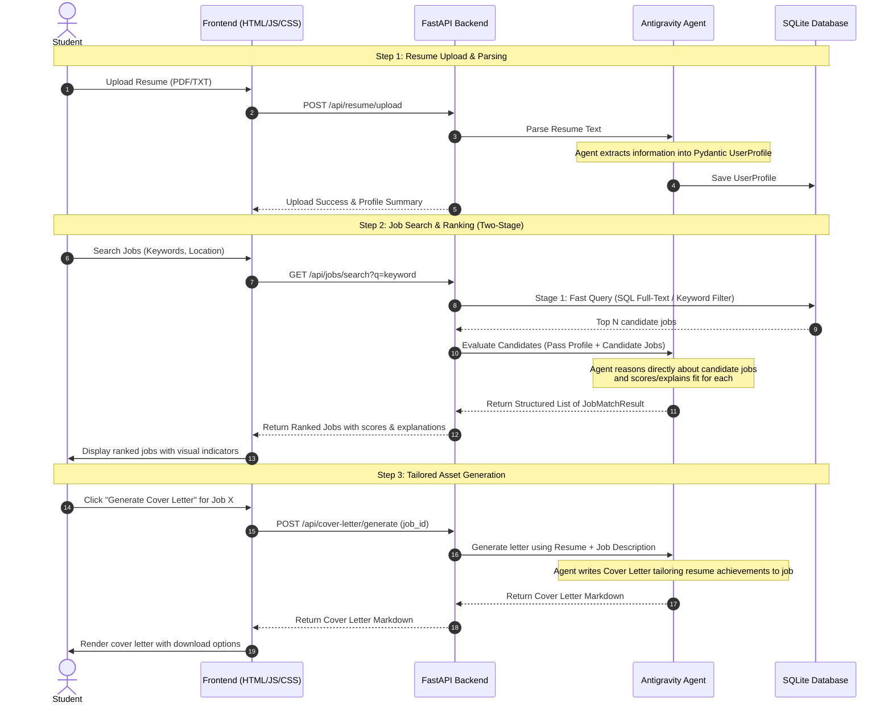

# CareerPilot AI: System Architecture & Design

CareerPilot AI is an intelligent career assistant that parses resumes, searches and retrieves matching job opportunities, ranks those opportunities based on user qualifications, and helps draft tailored cover letters.

---

## 1. System Architecture

The application is split into three main tiers:
1. **Frontend (UI)**: A modern, single-page web interface built with standard HTML5, CSS (incorporating modern aesthetics like glassmorphism and smooth transitions), and responsive vanilla JavaScript.
2. **Backend Services (FastAPI)**: Web server exposing API endpoints for uploading documents, searching jobs, and initiating agent conversations.
3. **AI Layer (Google Antigravity SDK & Gemini)**: An agentic loop equipped with specialized tools to execute resume extraction, semantic re-ranking, and cover letter generation.

### System Flow Diagram


---

## 2. Core Concepts Explained

To build a high-performance, cost-effective, and smart AI system, we are implementing three essential design patterns:

### A. Two-Stage Retrieval & Re-ranking
* **The Problem**: Directly sending hundreds of job descriptions from a database to an LLM for ranking is highly expensive, slow, and hits rate/token limits.
* **The Solution**: 
  - **Stage 1 (Retrieval)**: We use standard database queries (SQL full-text search or keyword matching) to instantly filter down a list of 100+ jobs to the top 10–15 candidate jobs.
  - **Stage 2 (Re-ranking)**: We pass only these 10–15 candidate jobs to the Gemini model along with the user's profile. The LLM performs a deep, qualitative evaluation to score and explain the match.

### B. Structured Outputs (Pydantic + Gemini)
* **The Problem**: Standard LLMs return raw text (e.g., "I think this is an 8/10 because..."), which is difficult for code to parse reliably and render in a UI.
* **The Solution**: We define strict data models using Python's `pydantic` library. We instruct the Google ADK connection to enforce schema matching, ensuring Gemini outputs perfectly formatted JSON that maps directly to our database and frontend components.

### C. Agentic Tool Calling (Function Calling)
* **The Problem**: The LLM itself cannot query databases, read local files, or fetch data.
* **The Solution**: We equip the `Agent` with Python functions wrapped as **Tools**. The agent uses its reasoning capabilities to decide when to call these tools (e.g., calling `search_jobs_tool` when the user asks "Find me developer roles").

---

## 3. Data Schemas

We will define three main models using Pydantic:

### 1. `UserProfile`
Represents the structured representation of a parsed resume.
```python
from pydantic import BaseModel, Field
from typing import List, Optional

class Experience(BaseModel):
    title: str = Field(description="Job title or role")
    company: str = Field(description="Company or organization name")
    duration: str = Field(description="Timeframe of the role, e.g. June 2023 - Present")
    responsibilities: List[str] = Field(description="Bullet points describing duties and achievements")

class Education(BaseModel):
    degree: str = Field(description="Degree, major, or certification")
    institution: str = Field(description="School, university, or issuing body")
    year: str = Field(description="Graduation year or completion date")

class UserProfile(BaseModel):
    name: str = Field(description="Candidate full name")
    email: str = Field(description="Candidate email address")
    phone: Optional[str] = Field(None, description="Candidate contact number")
    skills: List[str] = Field(description="Key technical and soft skills")
    experience: List[Experience] = Field(description="List of past professional experiences")
    education: List[Education] = Field(description="List of educational qualifications")
```

### 2. `Job`
Represents the jobs stored in our database.
```python
class Job(BaseModel):
    id: int
    title: str
    company: str
    location: str
    description: str
    requirements: List[str]
    salary_range: Optional[str] = None
```

### 3. `JobMatchResult`
The output of the re-ranking agent analyzing a job against the profile.
```python
class JobMatchResult(BaseModel):
    job_id: int
    score: int = Field(description="Overall match score from 0 (poor fit) to 100 (perfect fit)")
    reasoning: str = Field(description="1-2 sentences summarizing why this score was given")
    pros: List[str] = Field(description="Key strengths matching the candidate's profile to the job")
    cons: List[str] = Field(description="Missing skills or potential gaps in experience")
    skills_to_highlight: List[str] = Field(description="Specific candidate skills to emphasize for this role")
```

---

## 4. Required Tools

The Agent will be configured with the following custom tools:
1. `search_jobs(query: str, location: Optional[str] = None) -> List[Job]`: Queries the SQLite database for jobs matching query keywords.
2. `generate_cover_letter(profile: UserProfile, job: Job) -> str`: Takes the candidate profile and selected job to draft a personalized cover letter.

Note: The evaluation and ranking of jobs is NOT delegated to a tool. The Antigravity Agent itself performs this reasoning internally when given the user's profile and candidate jobs, outputting structured [JobMatchResult](file:///Users/drizy/Documents/careerpilot-ai/architecture.md#3-jobmatchresult) data directly in its turn.